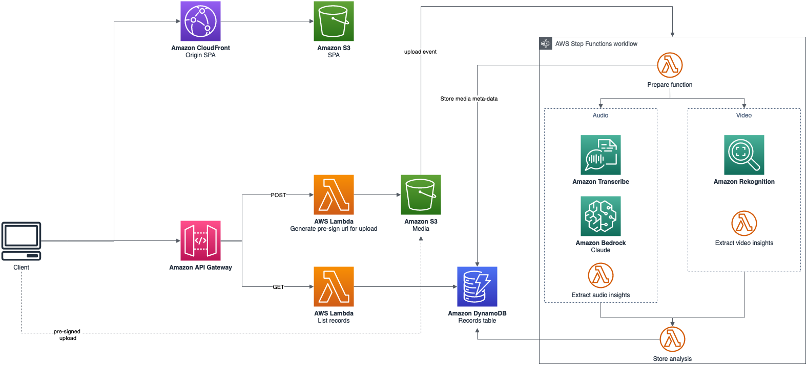

# Interview Mentorship

This repository is part of the interview simulation solution prototype.

## Architecture

## Prerequisites

It is recommended to run this prototype in a sandbox account. The prototype does not have tests, and not all security best practices are implemented.

To deploy the solution, you will need:

- [AWS CLI](https://docs.aws.amazon.com/pt_br/cli/latest/userguide/getting-started-install.html)
- [AWS SAM CLI](https://docs.aws.amazon.com/serverless-application-model/latest/developerguide/install-sam-cli.html)
- Region _us-east-1_
- Node.js v18.16.0, NPM v9.5.1, Python v3.8.8

## Getting Started

1. Deploy the [backend](./backend/README.md)
2. Change [API endpoint](./frontend/src/services/api.js)
3. Deploy [frontend](./frontend/README.md)
